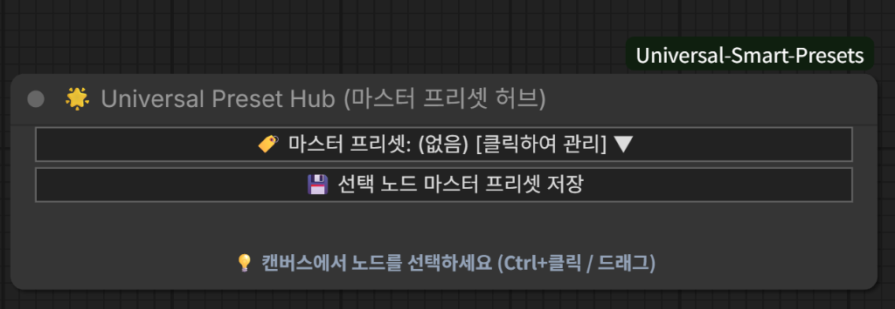
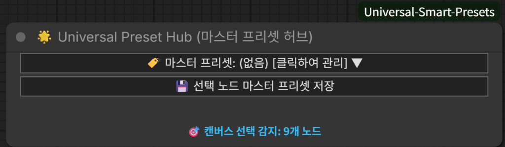
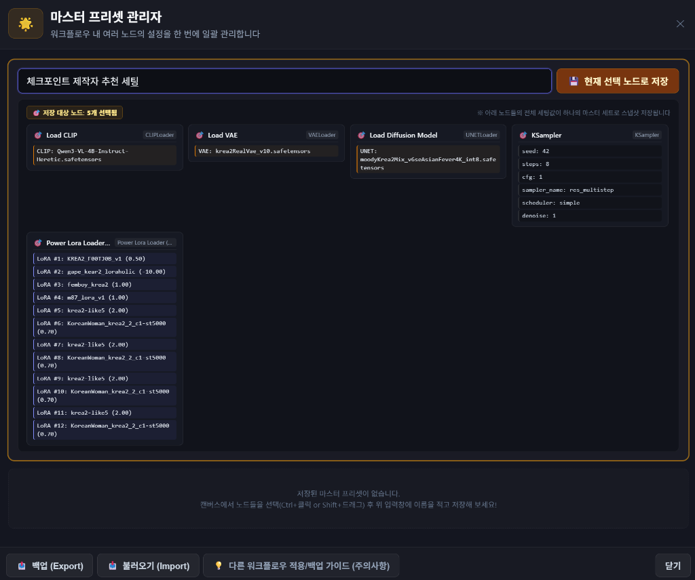
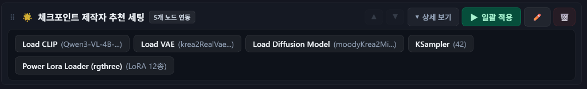
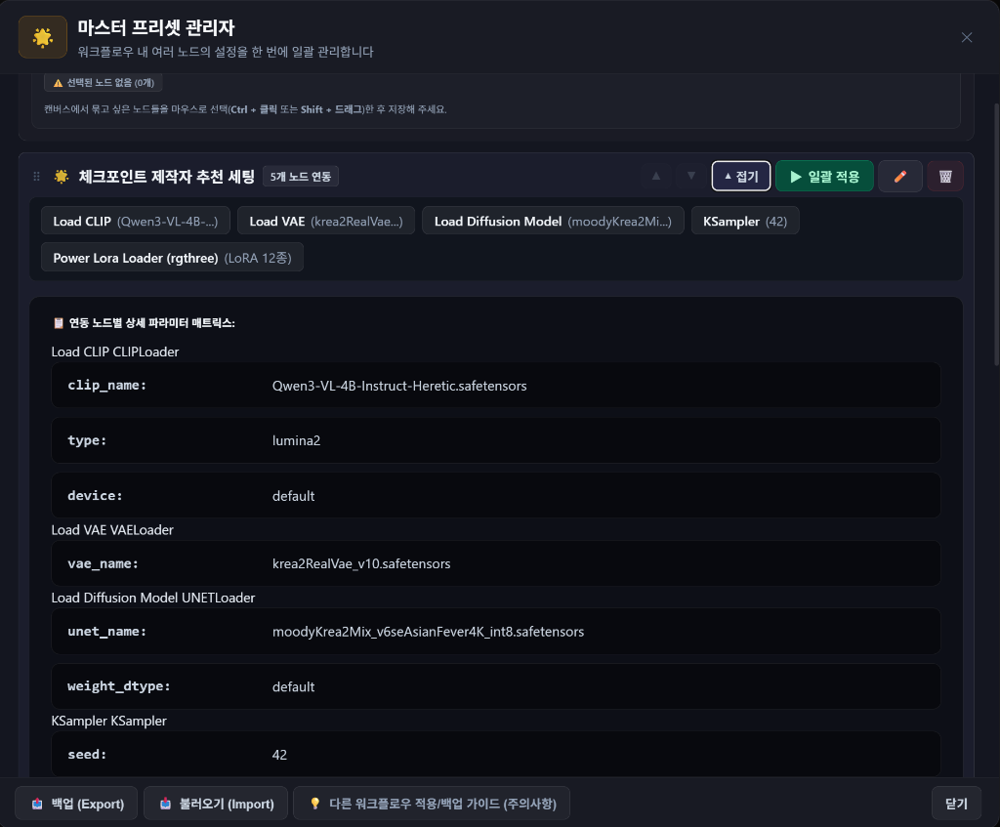
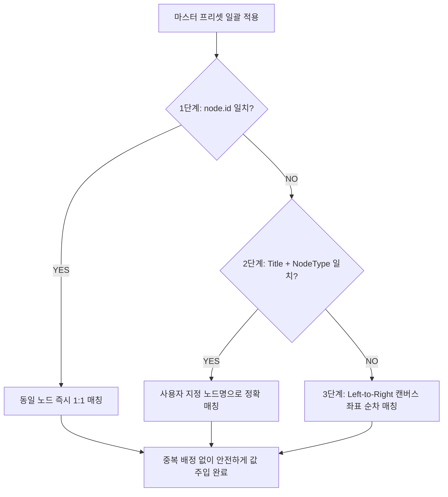

# 🌟 ComfyUI Universal Smart Presets & Master Hub

ComfyUI의 모든 단일 노드 및 다중 노드 묶음을 위한 **차세대 스마트 프리셋 관리 확장 기능(Custom Node)**입니다.  
복잡한 워크플로우의 다중 노드 설정을 통째로 스냅샷 저장하고 원클릭으로 전환하는 **🌟 Universal Preset Hub (마스터 허브)**와 개별 노드별 세밀한 **🌐 Global Smart Presets**를 제공합니다.

---

## 📑 목차 (Table of Contents)
1. [🌟 Universal Preset Hub (마스터 프리셋 허브)](#1--universal-preset-hub-마스터-프리셋-허브)
   - [핵심 기능 및 특징](#-핵심-기능-및-특징)
   - [📸 시각적 사용 가이드 (5단계)](#-시각적-사용-가이드-5단계)
   - [🧠 스마트 3단계 노드 매칭 엔진](#-스마트-3단계-노드-매칭-엔진-3-tier-matching)
2. [🌐 글로벌 프리셋 관리자 (Global Node Presets)](#2--글로벌-프리셋-관리자-global-node-presets)
3. [🛡️ 백업 및 불러오기 (Backup & Import/Export)](#3-️-안전한-백업--공유-backup--importexport)
4. [🚀 설치 방법 (Installation)](#-설치-방법-installation)
5. [📂 파일 구조 (File Structure)](#-파일-구조-file-structure)

---

## 1. 🌟 Universal Preset Hub (마스터 프리셋 허브)

> **"체크포인트, VAE, CLIP, 다중 LoRA, KSampler 설정까지 — 단 한 번의 클릭으로 전체 워크플로우 셋업을 즉시 전환하세요!"**

워크플로우가 복잡해질수록 모델 교체나 파라미터 변경 시 여러 노드를 일일이 찾아가며 값을 바꿔야 하는 번거로움이 있습니다.  
`Universal Preset Hub`는 캔버스에서 원하는 여러 노드를 선택하여 **하나의 통합 마스터 프리셋**으로 저장하고, 언제든지 단 1초 만에 전체 노드에 설정을 일괄 적용합니다.

---

### 💡 핵심 기능 및 특징

- **다중 노드 일괄 스냅샷**: 캔버스에서 드래그 또는 `Ctrl + 클릭`으로 선택된 모든 노드의 위젯 상태를 완벽 캡처
- **동적 LoRA 스택 무손실 저장**: `Power Lora Loader (rgthree)` 등 다중 LoRA 목록, 가중치, 개별 토글 상태까지 완벽 보존
- **초슬림 캔버스 위젯**: 작업 공간을 차지하지 않는 세련된 다크 글래스모피즘 2줄 UI
- **타 워크플로우 100% 호환**: 노드 ID가 달라져도 자동 인식하는 **3단계 스마트 매칭 알고리즘** 탑재
- **실시간 선택 노드 감지**: 캔버스에서 노드를 선택하면 허브 노드가 즉시 감지하여 노드 개수 표시

---

### 📸 시각적 사용 가이드 (5단계)

#### 🔹 Step 1. 캔버스 노드 배치 및 대기 상태
`Add Node -> presets -> 🌟 Universal Preset Hub`로 노드를 생성합니다. 캔버스에 선택된 노드가 없을 때는 친절한 안내 힌트가 표시됩니다.

<p align="center">
  
</p>

- **상단 드롭다운**: 저장된 마스터 프리셋 목록을 확인하거나 클릭하여 관리 모달 오픈
- **저장 버튼**: 현재 선택된 노드들로 새 마스터 프리셋 저장 모달 즉시 호출

---

#### 🔹 Step 2. 캔버스에서 대상 노드 다중 선택
마우스 드래그 영역 선택 또는 `Ctrl + 클릭`으로 묶어서 관리하고 싶은 노드들(예: CLIP, VAE, Diffusion Model, KSampler, LoRA 등)을 선택합니다.

<p align="center">
  
</p>

- 캔버스에서 노드를 선택하는 즉시 허브 노드가 `🎯 캔버스 선택 감지: N개 노드`로 실시간 반응합니다.

---

#### 🔹 Step 3. 마스터 프리셋 관리자에서 스냅샷 저장
`💾 선택 노드 마스터 프리셋 저장` 버튼을 누르면 관리자 모달이 열립니다.

<p align="center">
  
</p>

1. 상단 입력창에 프리셋 이름(예: `체크포인트 제작자 추천 세팅`)을 입력합니다.
2. 하단 **저장 대상 노드 미리보기 카드**에서 감지된 노드들과 현재 설정값(CLIP 모델, VAE 파일, UNET 파라미터, KSampler 시드/스텝, 12개 LoRA 목록 등)을 시각적으로 확인합니다.
3. `💾 현재 선택 노드로 저장` 버튼을 누르면 즉시 마스터 프리셋으로 스냅샷이 생성됩니다.

---

#### 🔹 Step 4. 저장된 마스터 프리셋 카드 & 원클릭 일괄 적용
저장된 프리셋은 시각적 요약 태그(알약 뱃지)와 함께 카드 형태로 관리됩니다.

<p align="center">
  
</p>

- **연동 노드 요약 태그**: `Load CLIP`, `Load VAE`, `Load Diffusion Model`, `KSampler (42)`, `Power Lora Loader (LoRA 12종)` 등 연동된 노드의 핵심 설정 요약 표시
- **`▶ 일괄 적용` 버튼**: 클릭 한 번으로 캔버스의 모든 연동 노드에 저장된 설정값을 1초 만에 주입
- **관리 기능**: 순서 변경(▲ / ▼), 프리셋 이름 변경(✏️), 프리셋 삭제(🗑️)

---

#### 🔹 Step 5. 연동 노드별 상세 파라미터 매트릭스 검토
프리셋 카드의 `▼ 상세 보기` 버튼을 누르면 저장된 각 노드별 파라미터 매트릭스가 펼쳐집니다.

<p align="center">
  
</p>

- 각 노드 타입별 세부 설정값(`clip_name`, `type`, `device`, `vae_name`, `unet_name`, `weight_dtype`, `seed` 등)을 한눈에 투명하게 확인하고 검토할 수 있습니다.

---

### 🧠 스마트 3단계 노드 매칭 엔진 (3-Tier Matching)

다른 사람의 워크플로우를 가져오거나, 워크플로우를 수정하여 노드 ID가 달라졌을 때도 설정을 정확하게 찾아 적용할 수 있도록 **3단계 스마트 매칭 알고리즘**이 작동합니다:



1. **Tier 1 (ID 고유 번호 매칭)**: 동일 워크플로우 내에서 가장 빠르고 정확하게 1:1 매칭
2. **Tier 2 (Title + Type 매칭)**: 사용자가 노드 제목을 지정한 경우 (예: `Base Sampler`, `Refiner Sampler`), 워크플로우가 바뀌어도 노드 제목을 추적하여 정확 매칭
3. **Tier 3 (Left-to-Right 순차 매칭)**: 노드 ID가 완전히 새로워진 타 워크플로우의 경우, 캔버스의 X/Y 배치 순서대로 1:1 순차 할당하여 **동일 노드에 중복 적용되는 문제를 원천 차단**

---

## 2. 🌐 글로벌 프리셋 관리자 (Global Node Presets)

개별 노드의 헤더 바에 자동으로 마운트되는 독립 프리셋 관리 시스템입니다.
- **모든 노드 자동 지원**: KSampler, Checkpoint Loader, VAE Loader, CLIP Text Encode, LoRA Loader 등 지원
- **선택적 파라미터 On/Off 토글**: 접힌 상태의 파라미터 알약 태그(Pill)를 클릭하여 특정 옵션(예: `seed`)만 제외(OFF)하여 적용 가능
- **양방향 실시간 동기화**: 접힌 상태 태그 ↔ 상세 보기 스위치 100% 실시간 연동
- **인라인 파라미터 에디팅**: `[-] [수치] [+]` 스텝퍼 버튼 및 설치된 모델/LoRA/스케줄러 자동 감지 드롭다운
- **1.5배 대형화 Pro Dark UI**: 시원하고 가독성 높은 다크 글래스모피즘 테마

---

## 3. 🛡️ 안전한 백업 & 공유 (Backup & Import/Export)

- **단일 JSON 백업 (Export)**: 언제든지 저장된 모든 마스터 프리셋 및 글로벌 프리셋을 단일 `.json` 파일로 추출
- **가져오기 (Import)**: 다른 PC나 새로운 환경에서 JSON을 불러오면 기존 목록과 안전하게 자동 병합(Merge)
- **내장 가이드 모달**: 타 워크플로우 적용 및 다중 동일 노드 사용 시 제목 지정 꿀팁 안내

---

## 🚀 설치 방법 (Installation)

1. ComfyUI의 `custom_nodes` 디렉토리에 클론합니다:
   ```bash
   cd ComfyUI/custom_nodes
   git clone https://github.com/solokjd-eng/ComfyUI-Universal-Smart-Presets.git
   ```
2. ComfyUI를 재시작하고 웹 브라우저에서 `Ctrl + F5`로 강력 새로고침합니다.

---

## 📂 파일 구조 (File Structure)

```text
ComfyUI-Universal-Smart-Presets/
├── __init__.py               # ComfyUI 백엔드 API & 허브 노드 등록
├── README.md                 # 설명 문서 & 사용자 가이드
├── docs/
│   └── assets/               # 가이드 스크린샷 이미지
│       ├── hub_01_canvas_idle.png
│       ├── hub_02_canvas_selected.png
│       ├── hub_03_modal_save_preview.png
│       ├── hub_04_master_preset_card.png
│       └── hub_05_matrix_detail_view.png
├── js/                       # 프론트엔드 웹 확장 소스
│   ├── smart_presets.js      # 글로벌 프리셋 & 지붕 배지 엔드포인트
│   ├── presets_modal.js      # 글로벌 프리셋 모달 UI & 스텝퍼
│   ├── presets_modal.css     # Pro Dark 1.5x 대형화 스타일시트
│   ├── hub_node.js           # 마스터 허브 노드 & 3단계 매칭 엔진
│   └── hub_modal.js          # 마스터 허브 전용 관리 모달창
└── web/                      # 웹 확장 배포 디렉토리
```

---

## 📄 License
MIT License

