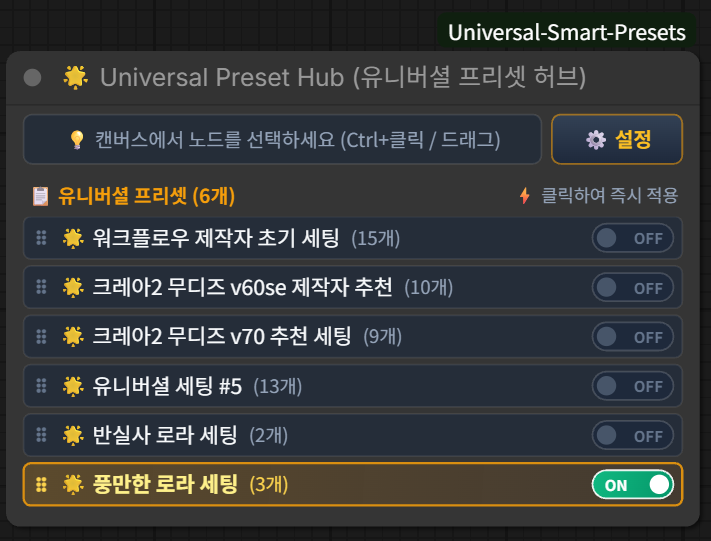
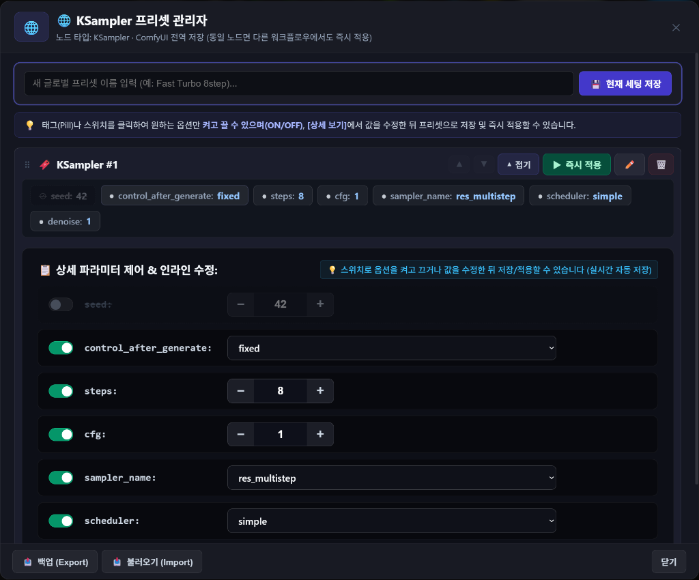
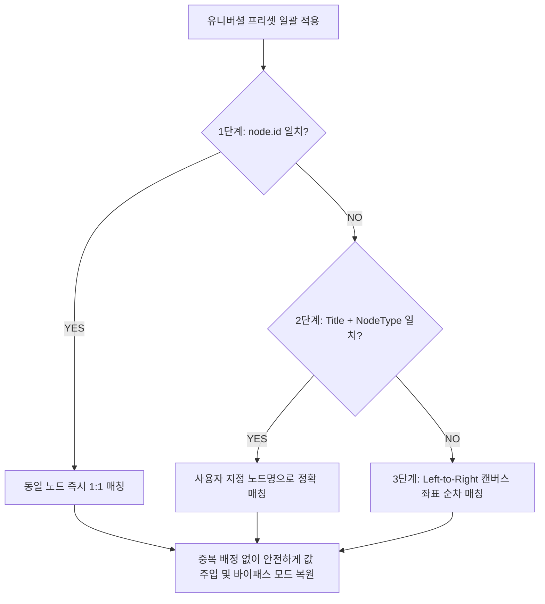

# 🌟 ComfyUI Universal Smart Presets & Master Hub

<p align="center">
  
</p>

<p align="center">
  <strong>ComfyUI를 위한 올인원 차세대 스마트 프리셋 & 워크플로우 스위처 시스템</strong><br>
  단 한 번의 클릭으로 체크포인트, LoRA, VAE, KSampler, 프롬프트는 물론 <strong>바이패스(Bypass) 분기</strong>까지 전체 워크플로우 설정을 캔버스에서 즉시 전환하세요!
</p>

<p align="center">
  <a href="#-주요-핵심-기능-highlights">✨ 주요 기능</a> •
  <a href="#-시각적-스크린샷-가이드-visual-guide">📸 시각적 가이드</a> •
  <a href="#-1-universal-preset-hub-유니버셜-프리셋-허브">🌟 유니버셜 허브</a> •
  <a href="#-2-글로벌-프리셋-관리자-global-presets">🌐 글로벌 프리셋</a> •
  <a href="#-설치-방법-installation">🚀 설치 방법</a>
</p>

---

## ✨ 주요 핵심 기능 (Highlights)

### 1. 🌟 Universal Preset Hub (유니버셜 프리셋 허브)
- **🔘 온캔버스 슬림 라디오 스위처 (Fast Groups Style)**: 노드 설정창을 열 필요 없이 캔버스 노드 본체에서 직접 `ON/OFF` 클릭 전환 (단일 활성화 독점 스위치)
- **📏 초슬림 24px 컴팩트 디자인 & 가로폭 적응형 텍스트**: 불필요한 여백을 30% 축소하여 날렵한 슬림 바 형태로 표시하며, 노드 창을 가로로 늘리면 긴 프리셋 제목도 잘림 없이 100% 선명하게 표시
- **🎯 1열 원터치 선택 감지 & 저장**: 캔버스에서 노드를 선택(`Ctrl+클릭` / 드래그)하면 버튼이 `🎯 캔버스 선택 감지: N개 노드 (저장 가능)`로 실시간 반응하며, 클릭 시 즉시 스냅샷 저장
- **👁️ 활성 프리셋 자동 화면 노출 (Auto-Scroll into View)**: 프리셋이 10개, 20개 이상으로 많아도 현재 선택된(ON) 프리셋이 항상 화면 뷰포트에 보이도록 스크롤 자동 보정
- **📡 다중 노드 실시간 무선 미러링 (Cloned Wireless Sync)**: 워크플로우 곳곳에 허브 노드를 여러 개 배치해도 모두 하나의 노드처럼 실시간 동기화 (화면 이동 최소화)
- **🟣 바이패스(Bypass) & 🔴 뮤트(Mute) 상태 완벽 지원**: 업스케일러, 디테일러, 얼굴 보정 등의 온/오프 분기를 프리셋마다 자유자재로 구성
- **🧠 3단계 스마트 노드 매칭 엔진**: 노드 ID가 달라진 타 워크플로우에서도 제목(Title), 타입(Type), 캔버스 좌표 순으로 완벽 자동 추적
- **🔒 제로 누출 & PNG 메타데이터 자동 동봉**: 워크플로우 저장(`Ctrl+S`) 및 이미지 생성 시 메타데이터에 프리셋 정보가 자동 저장되어 공유 시에도 100% 보존

---

### 2. 🌐 Global Smart Presets (글로벌 스마트 프리셋)
- **🏷️ 2-Tier 지붕 뱃지 (Roof Badges)**: 개별 노드 상단에 `[🌐 N]` (글로벌 프리셋 개수) 및 `[🌟 N]` (유니버셜 허브 연동 개수)가 직관적인 뱃지로 표시되어 원클릭 팝업
- **🖱️ 우클릭 컨텍스트 메뉴 완벽 통합**: 캔버스의 모든 노드 우클릭 시 `🌐 글로벌 프리셋` 하위 메뉴를 통해 즉시 저장 및 관리자 접근
- **🌍 ComfyUI 시스템 전역 영구 저장**: 워크플로우 파일과 무관하게 ComfyUI 시스템 전역에 저장되어, 동일 노드라면 어떤 새로운 워크플로우에서도 즉시 재사용
- **💊 선택적 파라미터 On/Off 알약 태그**: 원하는 파라미터(예: Seed만 제외, CFG만 적용 등)만 켜고 끄는 정밀 제어 지원

---

## 📸 시각적 스크린샷 가이드 (Visual Guide)

### 1️⃣ 🌟 유니버셜 프리셋 허브 노드 (온캔버스 스위처)
캔버스에서 여러 노드의 설정을 묶어 원클릭으로 즉시 전환할 수 있는 초슬림 컨트롤 타워 노드입니다.

<p align="center">
  
</p>

- **상단 좌측 버튼**: 캔버스에서 노드를 선택하면 `🎯 캔버스 선택 감지: N개 노드 (저장 가능)`로 활성화되어 클릭 한 번으로 새 프리셋 저장
- **상단 우측 `[⚙️ 설정]` 버튼**: 유니버셜 프리셋 허브 관리자 모달 팝업
- **슬림 라디오 행 (24px)**: 클릭 한 번으로 해당 프리셋의 전체 노드 설정 및 바이패스 모드를 1초 만에 일괄 주입
- **동적 가로폭 & 휠 스크롤**: 창을 넓히면 긴 제목이 모두 표시되며, 목록이 많을 때 부드러운 내부 휠 스크롤 지원

---

### 2️⃣ 📋 유니버셜 프리셋 허브 관리자
저장된 유니버셜 프리셋들을 시각적 알약 태그와 함께 검토하고, 순서 변경, 이름 수정, 백업/가져오기를 수행합니다.

<p align="center">
  
</p>

- **노드 연동 태그 & 🟣 바이패스 상태 표시**: 각 프리셋에 포함된 노드 요약 및 `(🟣 바이패스)` 실행 모드가 한눈에 파악됩니다.
- **관리 도구**: 순서 변경(▲ / ▼), 프리셋 상세 매트릭스 검토, 프리셋 이름 수정(✏️), 삭제(🗑️)
- **하단 백업 & 불러오기**: 단일 `.json` 파일로 추출(Export) 및 타 PC에서 불러오기(Import) 지원

---

### 3️⃣ 🏷️ 개별 노드 2-Tier 지붕 뱃지 (Roof Badges)
캔버스의 모든 노드 상단에 프리셋 연동 상태를 알려주는 미려한 2-Tier 뱃지가 자동으로 마운트됩니다.

<p align="center">
  
</p>

- **`[ 🌐 1 ]` (보라색 글로벌 뱃지)**: 이 노드 종류에 저장된 전역 글로벌 프리셋 개수 (클릭 시 글로벌 프리셋 관리자 오픈)
- **`[ 🌟 4 ]` (골드 유니버셜 뱃지)**: 이 노드가 포함된 유니버셜 프리셋 개수 (클릭 시 유니버셜 허브 관리자 오픈)
- **툴팁 안내**: 마우스를 올리면 각 뱃지의 역할과 단축 가이드가 툴팁으로 안내됩니다.

---

### 4️⃣ 🖱️ 우클릭 컨텍스트 메뉴 통합
노드를 우클릭하여 언제 어디서나 손쉽게 글로벌 프리셋을 저장하고 관리할 수 있습니다.

<p align="center">
  
</p>

- **`💾 현재 세팅 글로벌 프리셋으로 저장...`**: 현재 노드의 파라미터를 즉시 새 글로벌 프리셋으로 저장
- **`📋 글로벌 프리셋 관리자 열기...`**: 해당 노드의 글로벌 프리셋 상세 관리자 모달 호출

---

### 5️⃣ 🌐 개별 노드 글로벌 프리셋 관리자 (각 값별 ON/OFF 선택 토글)
개별 노드의 모든 파라미터를 세밀하게 튜닝하고, **각 값을 개별적으로 켜고 끌 수 있는(ON/OFF)** 독립 프리셋 관리 시스템입니다.

<p align="center">
  
</p>

- **💡 각 파라미터별 ON/OFF 선택 토글**:
  - 상단 알약 태그(Pill)나 상세 보기의 토글 스위치를 클릭하여 **원하는 옵션만 자유롭게 켜고 끌 수 있습니다.**
  - 예시: 위 스크린샷처럼 `seed`만 OFF(취소선 및 어둡게 처리)하면, 프리셋 적용 시 **시드 번호는 유지한 채 `steps: 8`, `cfg: 1.0`, `sampler_name`, `scheduler`만 완벽하게 주입**됩니다.
- **양방향 실시간 동기화**: 접힌 상태의 알약 태그 ↔ 상세 파라미터 제어 스위치가 100% 실시간 연동됩니다.
- **인라인 스텝퍼 에디팅**: `[-] [수치] [+]` 버튼 및 드롭다운으로 모달 내에서 직접 값을 수정하여 저장 가능
- **ComfyUI 전역 영구 공유**: 워크플로우 파일이 바뀌어도 동일한 노드 종류(KSampler, VAE, CLIP, Model 등)라면 어디서든 즉시 불러와 사용 가능

---

## 🧠 스마트 3단계 노드 매칭 엔진 (3-Tier Matching)

타인의 워크플로우를 가져오거나 노드 번호(ID)가 바뀌어도 정확하게 값을 찾아 주입합니다:



1. **Tier 1 (ID 고유 번호 매칭)**: 동일 워크플로우 내에서 가장 빠르고 정확하게 1:1 매칭
2. **Tier 2 (Title + Type 매칭)**: 사용자가 노드 제목을 지정한 경우 (예: `메인 샘플러`, `디테일러 VAE`), 워크플로우가 바뀌어도 노드 제목을 추적하여 정확 매칭
3. **Tier 3 (Left-to-Right 순차 매칭)**: 노드 ID가 완전히 새로워진 타 워크플로우의 경우, 캔버스의 X/Y 좌표 배치 순서대로 1:1 순차 할당하여 중복 적용 방지

---

## 🚀 설치 방법 (Installation)

### 방법 1: Git Clone (권장)
ComfyUI의 `custom_nodes` 디렉토리에서 아래 명령어를 실행합니다:

```bash
cd ComfyUI/custom_nodes
git clone https://github.com/solokjd-eng/ComfyUI-Universal-Smart-Presets.git
```

### 방법 2: StabilityMatrix / ComfyUI Manager
- StabilityMatrix 패키지 매니저 또는 ComfyUI Manager를 통해 `ComfyUI-Universal-Smart-Presets`를 검색하여 설치할 수 있습니다.

> 💡 **설치 후**: ComfyUI를 재시작하고 웹 브라우저에서 **`Ctrl + F5` (강력 새로고침)** 를 눌러주세요!

---

## 📂 파일 구조 (File Structure)

```text
ComfyUI-Universal-Smart-Presets/
├── __init__.py               # ComfyUI 백엔드 API & 허브 노드 등록
├── README.md                 # 프로젝트 상세 가이드 문서
├── docs/
│   └── assets/               # 고화질 가이드 스크린샷 이미지
│       ├── 01_universal_hub_node.png
│       ├── 02_universal_hub_modal.png
│       ├── 03_node_roof_badges.png
│       ├── 04_context_menu.png
│       └── 05_global_preset_modal.png
├── web/                      # 프론트엔드 웹 확장 소스
│   ├── smart_presets.js      # 글로벌 프리셋 & 지붕 배지 엔드포인트
│   ├── presets_modal.js      # 글로벌 프리셋 모달 UI & 스텝퍼
│   ├── presets_modal.css     # Pro Dark 스타일시트
│   ├── hub_node.js           # 유니버셜 허브 노드 & 3단계 매칭 엔진
│   └── hub_modal.js          # 유니버셜 허브 관리 모달창
```

---

## 📄 License
MIT License. 자유롭게 사용, 수정, 배포하실 수 있습니다.
